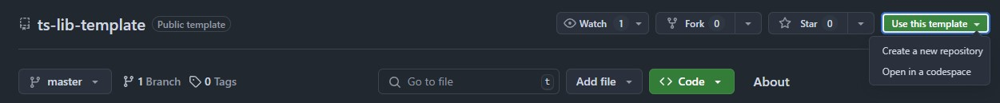

# ts-lib-template
> Simple TypeScript library template repository

Opinionated template for quickstart development of TypeScript/Vite library for SPA's or other Node projects.

The repository is themed as template, which means that anyone can create a new repository based on this one and start off with their own software building. As previously said, it is opinionated in terms of directory structure and used libraries to create a basic ready-to-publish [NPM](https://npmjs.com) package.

---

## How to use this template
The most straightforward way is to use this template directly from GitHub website view:

You may as well simply download this repository as a zip file and paste it into your existing repository.

Otherwise you can just get some inspiration by taking any parts of the code you found interesting :)

## Tech Stack
* [**Vite**](https://vite.dev/)
	* Bundler tool. Held at version ^5, waiting for stabilizing new v6
* [**TypeScript**](https://www.typescriptlang.org/)
	* Held at version ^5.4.0 due to TypeDoc peer dep
* [**ESLint**](https://eslint.org/) (base, typescript, stylistic)
	* Main package held at version ^8 due to waiting for stabilizing new v9
* [**TypeDoc**](https://typedoc.org/)
	* Successor of JSDoc, who was inspired by JavaDoc/Doxygen HTML generated documentation
* [**Vitest**](https://vitest.dev/)
* [**tsx**](https://tsx.is/) - TS Node runtime for scripts

## Folder structure
* **/lib** - Core implementation of the TS/JS library
* **/readme** - Contains any more detailed markdowns or metadata used for markdowns (such as local images). Example: **CHANGELOG.md**
* **/scripts** - Contains platform-agnostic implementation of certain operations invoked by **package.json** and `tsx` runtime
* **/src** - Contains code that runs via `vite dev` injected into bare `index.html`. This is to dev-test real browser environment, so that the library code can be tried out (does not replace unit tests).
* **/tests** - Unit tests utilized by `vitest`. There can be any subdirectory structure, so you can model it just how you would like it the most :)
* **/types** - Any environment modifications / TypeScript module augmentations for core `tsconfig.json`. You can ignore the existence of this directory if you don't plan to tinker with TypeScript too deeply.
* Generated directories
	* /dist - The outputted production build
	* /docs - The outputted static HTML page containing TypeDoc documentation
	* /tmp - Temporary file utilized by `doc` script to combine multiple readme files.
* Configuration files
	* `.editorconfig` - If you use VSCode and EditorConfig extension
	* `.eslintrc.cjs` - ESLint configuration
	* `index.html` - Minimal html for running HMR vite dev, uses `src/main.ts` to dev-test any currently developed code in `/lib`
	* `tsconfig.json` - One is found here in project root, defining core configuration for `/lib` and `/src` TS files. The other one is found in `/scripts/tsconfig.json`, which is meant for TS scripts only
	* `typedoc.config.cjs` - TypeDoc configuration. Here you can edit name/links/entrypoints for the generated documentation
	* `vite.config.ts` - Bundler configuration for building the library production package
	* `vitest.config.ts` - Unit tests configuration for environment, test source files detection, ...

## Prepared scripts
This template contains some premade scripts, which is meant as a suggestion to ease up all development work on simple JS library.

* `yarn`: Installs dependencies
* `yarn clean`: In case of things breaking, remove all generated directories
	* You can update this procedure in `scripts/clean.ts`
* `yarn dev`: Runs minimal `index.html` page for temporary dev-tests
* `yarn lint`: Runs ESLint on `/lib`, `/scripts` and `/tests` sources
* `yarn test`: Runs Vitest on `/tests` spec files with unit test implementations
* `yarn build`: Runs production build into `/dist` directory
* `yarn doc`: Generates `TypeDoc` static HTML documentation into `/docs`
	* You can update the specifics of this procedure in `scripts/doc.ts`
* `yarn deploy`: Manually performs `npm publish` with some preparation steps
	* You can change the procedure's behavior in `scripts/deploy.ts`, although that should not be necessary. This script eventuall calls `npm publish`, you can learn more about it on https://docs.npmjs.com/cli/v9/commands/npm-publish

## What to edit first
* Remove all dummy code from `/lib`
* If you don't wish to use any code within `/src`, you can delete it along with `index.html` in root of the project
* `tests/*` - Delete tests sources that are tied to dummy `/lib` implementation
* `README.md` - This readme
* `package.json` - Edit `name`, `version`, and many more fields according to your needs
* `typedoc.config.cjs` - Edit package name and change/delete navigation links
* `readme/SCAFFOLDING.md` - You can delete this. If you proceed to do so, edit `sripts/doc.ts`, so that the script will not attempt to concatenate that markdown file into generated HTML documentation.
* `readme/CHANGELOG.md` - Clear contents or delete (if you delete, don't forget with editing step in the script)
* `LICENSE` - Edit or delete

## License
This repository is released under [MIT license](https://opensource.org/license/MIT), which means that you can reuse any part of code here for your convenience.

Copyright (C) 2025-present, Andrej Hučko

<b>If you like this template, don't hesitate to give this repository a star! 😊</b>

* ~
